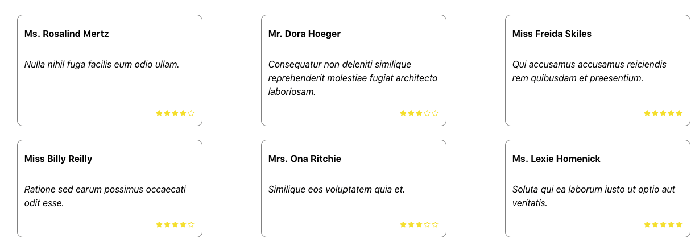

# League Coding Challenge

## Challenge Description

In this repository a basic React application has been set up. The purpose of this application is to display reviews from a JSON file that is fetched from an endpoint.

Some functionality and styling is not complete.

Please follow the steps below and track your progress using git. Once you have completed the steps, please submit your work to us by sending through a zip file containing your repository or uploading it to GitHub and providing a link.

Good luck!

### 1. Review summary

The total number of reviews and average score are not correct. Update the App component to display the correct values.

### 2. Reviews display

The reviews are displayed in a list below the summary. Update the Reviews component to correctly display the data from the reviews.

Each review should have 5 stars displayed, with some filled based on the rating. Update the component to do this.

e.g. for a review with a rating of 3, 3 stars should be filled followed by 2 stars unfilled.

### 3. Design updates

Update the reviews to match the following design.

### 4. Tests

Some tests are failing. Identify why and correct them.

## Setup

To begin, you'll need to have a recent version of node installed on your computer (12 preferred).

Install the dependencies by running `yarn`.

## Commands

### `yarn start`

Runs the app in the development mode.

Open [http://localhost:3000](http://localhost:3000) to view it in the browser.

The page will reload if you make edits.

### `yarn test`

Launches the test runner in the interactive watch mode.

See the section about [running tests](https://facebook.github.io/create-react-app/docs/running-tests) for more information.
